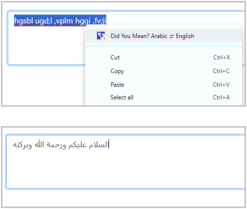

# Did You Mean? – Arabic ⇄ English Keyboard Fix

A lightweight browser extension that fixes text typed using the wrong Arabic or English keyboard layout.

This extension is built on top of the open-source dym-ar-en library:
https://www.npmjs.com/package/dym-ar-en

---

## What it does

If you accidentally type while your keyboard language is set incorrectly, this extension lets you fix it instantly.

Examples:

- hgsbl ugd;l → السلام عليكم  
- اثممخ → hello  

It works like a “Did you mean?” correction, but for keyboard layouts instead of spelling.

---

## How to use

1. Select text inside an input, textarea, or editable field  
2. Right-click  
3. Choose Did You Mean? Arabic ⇄ English  

<p align="center">
  
</p>


The selected text is replaced with the corrected version.

Undo is fully supported using Ctrl+Z.

---

## Where it works

- Input fields  
- Textareas  
- Contenteditable editors  
- Chat apps such as WhatsApp Web, Telegram Web, and Gmail  
- Rich editors like Notion and CMS editors  

The context menu only appears in editable fields and never on static page text.

---

## Privacy

This extension is completely privacy-friendly.

- No data collection  
- No analytics  
- No tracking  
- No network requests  

All text correction happens locally in your browser.

---

## Performance

- Runs only when you manually trigger it  
- No background scanning  
- No persistent content scripts  
- Very small footprint  

---

## Core engine

The keyboard correction logic is implemented in the dym-ar-en npm package.

You can use the same engine directly in:
- Node.js applications  
- Web applications  
- Automation scripts  

---

## Development

Install dependencies:

```
npm install
```

Build the extension:

```
npm run build
```

Load the extension for testing:

- Chrome: chrome://extensions → Enable Developer Mode → Load unpacked  
- Firefox: about:debugging → This Firefox → Load Temporary Add-on  

---

## Browser support

- Google Chrome  
- Chromium-based browsers  
- Mozilla Firefox  

The extension uses modern browser APIs and follows Manifest Version 3 standards.

---

## License

MIT
